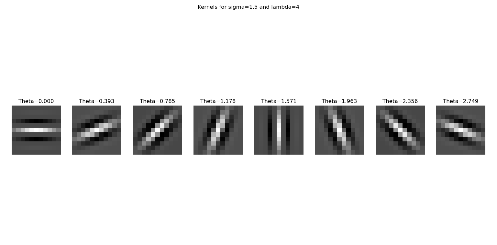
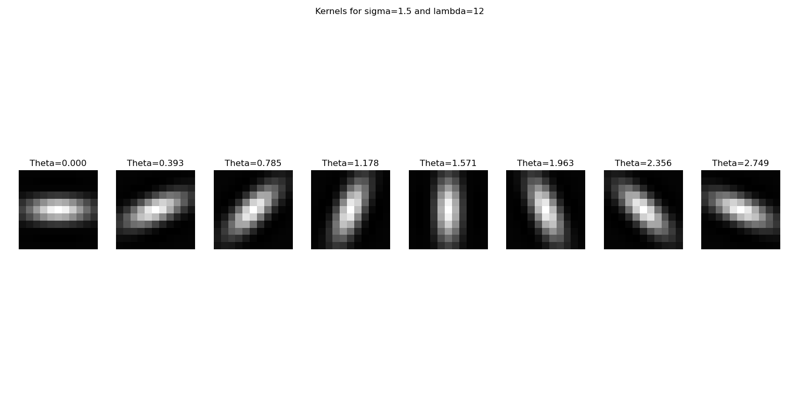
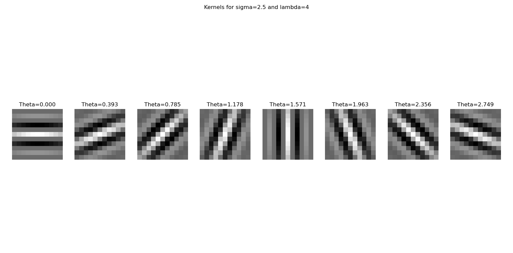
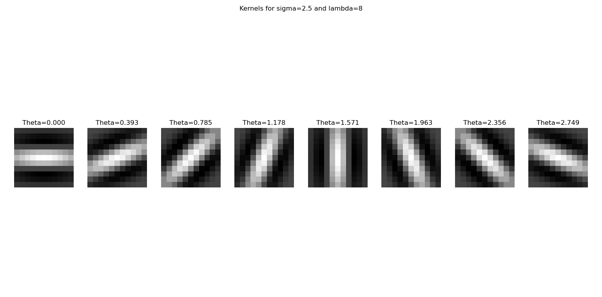
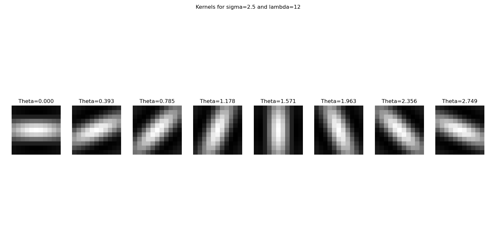

# CK+ Emotion Recognition

This project implements facial emotion recognition on the CK+ dataset using Gabor filter-based features and Support Vector Machines. 

## Dataset:
CK+(Extended Cohn Kanade) Dataset is found from https://www.kaggle.com/datasets/davilsena/ckdataset. 

Fer2013 Dataset is found from https://www.kaggle.com/datasets/msambare/fer2013.

Full dataset descriptions are available at the links above. 

## Methodology

### Gabor Filter Bank
A bank of Gabor Filters is constructed with multiple orientations and spatial frequencies. Each filter captures texture and edge informations at a specific orientation and scales, which makes the filter bank well-suited for encoding localised facial changes associated with distinct emotional expressions.

Example of Gabor Filter Bank:

### Feature Extraction
Each input image is convolved with every filter in the bank, producing 'N' feature maps per image. Each feature map is then partitioned into 4*4=16 non-overlapping blocks and a statistical descriptor (e.g. mean) is computed per block. So the final feature vector for a single image is of "N × 16"; where N is the total number of kernels in the bank and it is computed as  N = (no. of different scales)×(no of different wavelengths)×(no of different orientations).

### Classification
Features are L2-normalised and fed into Linear Support Vector Machine (SVM). The dataset's original train/test split (80% training, 20% testing) is used throughout the experiments.

## Results
See [RESULTS.md](Results.md) for detailed evaluation.

## How to Run
**Prerequisites** Refer to [requirements](requirements.txt) to ensure all dependencies are installed.
1. Download the CK+ dataset
2. Place it inside the src folder
3. Run src/Gabor_Outputs_generation.py (This will generate a file named outputs_ck.npy inside data folder)
4. Run src/Feature_Extraction.py (This will generate a file named imgwise_blockmeans_ck.npy inside data folder)
5. Run src/Classification.py

## General Description of the different code files

There are 3 main files:
1) Gabor_Outputs_generation.py =: Here I created the Gabor Filter bank and then apply them on each image present in the dataset. We get (no_of_input_images * no_of_filters_in_the_bank) no. of outputs.

2) Feature_Extraction.py =: In this file, I took all the outputs and break them into non-overlapping blocks. For every block, I calculated some statistic and I will use these statistics as features. So for one input image, I will get (no_of_outputs_per_input_image * no_of_blocks_per_output) features.

NOTE: no_of_outputs_per_input_image is equal to no_of_filters_in_the_bank

3) Classification.py =: In this file, I split the data into training(80%) and testing(20%). In the dataset itself there was a column that showed which image is used in Training or in Testing. I followed that column. I used SVM classifier for the classification after normalizing all the features.

